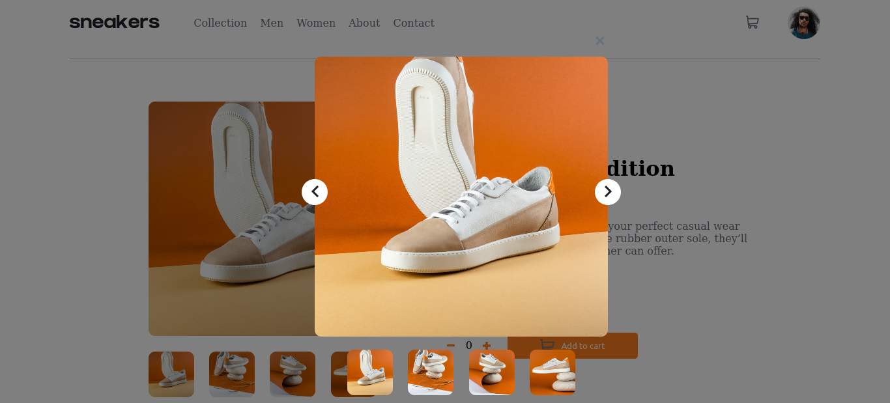
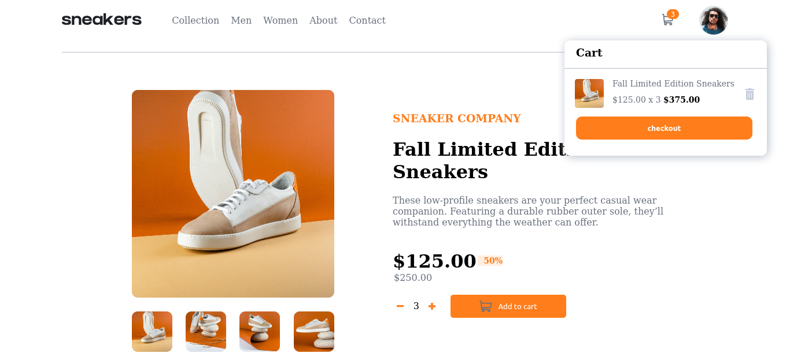

# Frontend Mentor - E-commerce product page solution

This is a solution to the [E-commerce product page challenge on Frontend Mentor](https://www.frontendmentor.io/challenges/ecommerce-product-page-UPsZ9MJp6). Frontend Mentor challenges help you improve your coding skills by building realistic projects.

## Table of contents
  - [The challenge](#the-challenge)
  - [Screenshot](#screenshot)
  - [Links](#links)
  - [Built with](#built-with)
  - [Author](#author)

### The challenge

Users should be able to:

- View the optimal layout for the site depending on their device's screen size
- See hover states for all interactive elements on the page
- Open a lightbox gallery by clicking on the large product image
- Switch the large product image by clicking on the small thumbnail images
- Add items to the cart
- View the cart and remove items from it

### Screenshot

- Live Site URL: [live site URL](https://akashsiddamshettyecommmertemplate.netlify.app/)

### Built with

- Semantic HTML5 markup
- CSS custom properties
- Scss 
- Flexbox
- CSS Grid
- material ui
- Mobile-first workflow
- [React](https://reactjs.org/) - JS library

## Author

- Website - [Akash siddamshetty](https://github.com/akashsiddamshetty)
- Frontend Mentor - [@akashsiddamshettyy](https://www.frontendmentor.io/profile/akashsiddamshetty)
- Twitter - [@4k4_s_h](https://twitter.com/4k4_s_h)
